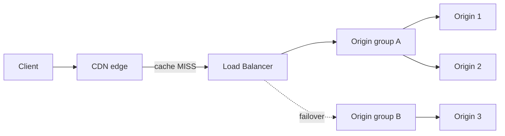

The Load Balancer distributes uncached requests from your Pull Zones across multiple origin servers. Each request is routed using a configurable balancing method, origin health is monitored continuously, and traffic automatically fails over to healthy origins when a server becomes unavailable.

A Load Balancer is a reusable routing policy that lives on your account. It does not have its own hostname. Instead, you attach it to one or more Pull Zones, and the CDN edge applies it whenever a request needs to be fetched from an origin. Requests served from the CDN cache never reach the Load Balancer.

## How it works

When a request misses the cache, the edge server builds an ordered list of all eligible origins: it first orders your origin groups (by priority, then by the group balancing method), then orders the origins inside each group (by the group's origin balancing method). The first origin in the list receives the request, and the rest of the list is the failover order if it fails.

## Concepts

| Concept | Description |
|---------|-------------|
| Load Balancer | An account-level routing policy with a name, a group balancing method, and optional sticky sessions. Attachable to any number of Pull Zones. |
| Origin group | A set of origins treated as one unit for balancing and failover. Each group has its own balancing method, weight, priority, and health check settings. |
| Origin | A single backend: an HTTP(S) server, a Storage Zone, an Edge Script, or a Magic Containers endpoint. |

## Connect a Pull Zone

<Steps>
  <Step title="Create a Load Balancer">
    Create a Load Balancer with a unique name and choose how traffic is distributed between origin groups.
  </Step>
  <Step title="Add origin groups and origins">
    Add at least one origin group, then add your origins to it. See [Origins and origin groups](/cdn/load-balancer/origins) for the available origin types and settings.
  </Step>
  <Step title="Attach it to a Pull Zone">
    Set the Pull Zone's origin type to **Load Balancer** and select your Load Balancer. The Pull Zone's own origin URL is no longer used; each origin defines its own destination.
  </Step>
</Steps>

A single Load Balancer can be attached to multiple Pull Zones, and all attached zones share the same routing policy. Switching a Pull Zone back to a different origin type detaches it again. A Load Balancer cannot be deleted while any Pull Zone still uses it as its origin.

All configuration is also available through the API. See the [API reference](/api-reference/core) for the full endpoint documentation.

## Explore

<CardGroup cols={2}>
  <Card title="Origins and origin groups" href="/cdn/load-balancer/origins">
    Origin types, connection settings, and limits.
  </Card>
  <Card title="Routing methods" href="/cdn/load-balancer/routing">
    How origin groups and origins are selected, weights, and priority tiers.
  </Card>
  <Card title="Sticky sessions" href="/cdn/load-balancer/sticky-sessions">
    Pin returning visitors to the same origin using cookies.
  </Card>
  <Card title="Health and failover" href="/cdn/load-balancer/health-and-failover">
    Health checks, failure detection, and automatic failover behavior.
  </Card>
  <Card title="Statistics" href="/cdn/load-balancer/statistics">
    Per-origin traffic, latency, and failure metrics.
  </Card>
  <Card title="Pricing" href="/cdn/load-balancer/pricing">
    Monthly fee, included requests, and overage billing.
  </Card>
</CardGroup>

<Note>
  Looking for DNS-level load balancing across multiple record values? That is a separate feature of Bunny DNS. See [DNS load balancing](/dns/records#load-balancing).
</Note>
