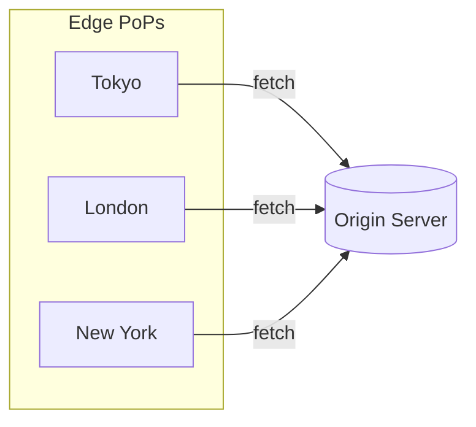
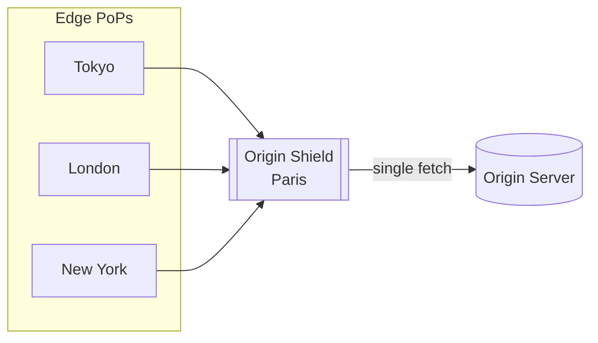

Origin Shield is a secondary caching layer that sits between Bunny's edge PoPs and your origin server. Instead of each PoP fetching files directly from your origin, all requests pass through a single Origin Shield location first.

This consolidates cache misses into one point, dramatically reducing the number of requests that actually reach your origin, especially when the same files are requested from different regions around the world.

<Note>
  Origin Shield is **not** a Web Application Firewall (WAF). It doesn't filter
  or block requests, it strictly minimizes origin traffic. For security features
  like WAF, DDoS protection, and bot detection, see [Bunny Shield](/shield).
</Note>

## How it works

**Without Origin Shield** — each PoP fetches directly from your origin:

Your origin receives three separate requests for the same file.

**With Origin Shield** — all PoPs route through a single cache:

Your origin receives one request. Subsequent PoP requests are served from the Origin Shield cache.

## Enable Origin Shield

<Steps>
  <Step title="Open your Pull Zone settings">
    Go to **CDN** > **Pull Zones** and select your zone.
  </Step>
  <Step title="Navigate to Origin Shield">
    Go to **Origin Shield** in the **Caching** section.
  </Step>
  <Step title="Select a region">
    Enable Origin Shield and choose a location closest to your origin server.

    <Frame>
      
    </Frame>

  </Step>
</Steps>

## Choosing a region

Select the Origin Shield location that is:

- **Closest to your origin server's physical location**, or
- **In the region with your highest cache HIT rate**

If your origin is in Frankfurt, choose the European Origin Shield. If most of your traffic comes from North America regardless of where your origin is hosted, the US location may give better results.

## Trade-offs

Origin Shield adds an extra network hop between edge PoPs and your origin. Depending on the distance between the Origin Shield location and your origin, this can introduce slight additional latency on cache misses.

For most use cases, the reduction in origin load far outweighs this overhead. But if ultra-low latency on cache misses is critical and your origin can handle the traffic, you may want to test with and without Origin Shield.

<Info>
  Concurrency limits are especially useful for dynamic content or CPU-intensive
  requests where your origin can get slower under high concurrency.
</Info>

## Pricing

Origin Shield is available at no extra cost. Traffic transferred from Origin Shield locations to CDN edge nodes does not incur any charges.
