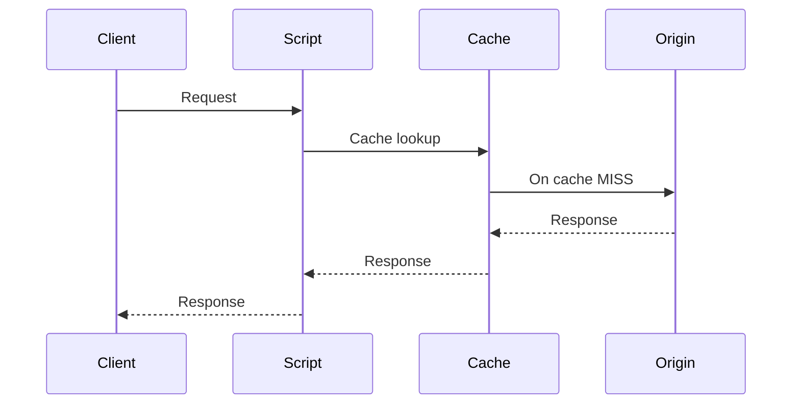

By default, edge scripts run **after** the cache. The CDN serves cached
responses directly, without invoking your script, so cached traffic is not
slowed down by script execution.

With before cache execution enabled, your script runs on **every request**,
before the cache lookup. This gives you full control over the request flow at
the cost of executing your script even for cached content.

Post-cache execution remains the default. Enable before cache execution when
you need per-request logic, such as authentication, tenant-aware routing, or
custom caching rules.

## Enable before cache execution

Before cache execution is enabled at the Pull Zone level and applies to the
script linked to that Pull Zone.

Navigate to your Pull Zone, then go to **General** > **Origin** and enable
**Run script before cache**.

For standalone scripts, you can use the same Pull Zone toggle or enable it
directly in the script settings.

## Middleware scripts

When before cache execution is enabled, middleware scripts gain access to two
additional hooks that run on the client side of the cache:

- **`onClientRequest`**: runs on every incoming request before the cache
  lookup. Modify the request or short-circuit by returning a response
  directly.
- **`onClientResponse`**: runs just before the response is sent to the
  client, including responses served from the cache.

```ts
import * as BunnySDK from "@bunny.net/edgescript-sdk@0.13.0-rc.0";

BunnySDK.net.http
  .servePullZone({ url: "https://your-origin.com" })
  .onClientRequest((ctx) => {
    // Runs before the cache lookup on every request
    return Promise.resolve(ctx.request);
  })
  .onClientResponse((ctx) => {
    // Runs before the response is sent to the client
    return Promise.resolve(ctx.response);
  });
```

See [Middleware scripts](/scripting/middleware/overview) for the full hook
reference and workflow.

## Standalone scripts

Standalone scripts act as the origin for their Pull Zone, so by default they
only execute when the cache is missed. With before cache execution enabled,
your script handles **every request** before the cache lookup, and decides
whether and how responses are cached.

See [Standalone scripts](/scripting/standalone/overview) for details.

## Workflow


