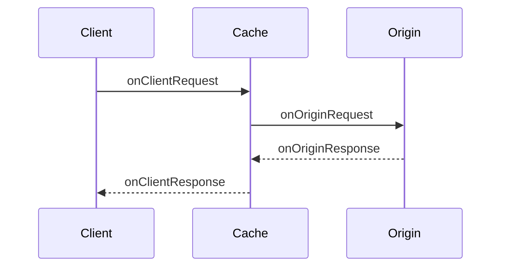

Middleware scripts act as intermediaries within the CDN request workflow, allowing you to insert custom logic that modifies requests or responses as they pass through the CDN.

## Use cases

- **Authentication and authorization** — Verify credentials and manage session tokens at the edge
- **Header injection and manipulation** — Add, modify, or remove HTTP headers on requests and responses
- **Response body transformation** — Rewrite HTML, inject scripts, or modify content before delivery
- **A/B testing and feature flags** — Route users to different versions based on headers or cookies
- **Request routing and redirects** — Direct traffic based on path, geolocation, or custom logic
- **Security enhancements** — Implement rate limiting, IP filtering, or bot protection

## Benefits

Middleware scripts provide the flexibility to integrate complex logic into the CDN request flow without modifying backend infrastructure. By processing requests and responses directly at the edge, these scripts improve the overall speed and efficiency of content delivery while reducing reliance on backend processing power.

## The `servePullZone` function

The `servePullZone` function creates a middleware handler that integrates with your Pull Zone. It returns a chainable object for adding request and response middleware.

```ts
import * as BunnySDK from "@bunny.net/edgescript-sdk";

BunnySDK.net.http
  .servePullZone({ url: "https://your-origin.com" })
  .onOriginRequest((ctx) => {
    // Modify or intercept requests
    return Promise.resolve(ctx.request);
  })
  .onOriginResponse((ctx) => {
    // Modify responses
    return Promise.resolve(ctx.response);
  });
```

### Function signature

```ts
servePullZone(options: { url: string }): PullZoneHandler
```

| Option | Type     | Description                                                                                                           |
| ------ | -------- | --------------------------------------------------------------------------------------------------------------------- |
| `url`  | `string` | The origin URL to proxy requests to. Only used during local development; in production, the Pull Zone origin is used. |

<Info>
  The `url` option is only used during local development. When deployed to
  bunny.net, requests are proxied to the origin configured in your Pull Zone
  settings.
</Info>

## Middleware methods

The `servePullZone` function returns a `PullZoneHandler` object with chainable middleware methods:

### `onClientRequest`
<Badge color="orange" icon="sparkles">Preview</Badge>

<Info>
If your PullZone is configured to execute script before cache, you'll have
access to this function.
</Info>

Intercepts requests before they are sent to the cache. You can modify the request
or short-circuit by returning a response directly.

```ts
onClientRequest(
  middleware: (ctx: { request: Request }) => Promise<Response> | Response | Promise<Request> | Request | void
): PullZoneHandler
```

| Property      | Type      | Description                 |
| ------------- | --------- | --------------------------- |
| `ctx.request` | `Request` | The incoming request object |

**Return value:**

- Return `Promise<Request>` to continue to the origin with the (modified) request
- Return `Promise<Response>` to short-circuit and respond immediately without
  hitting the cache

### `onClientResponse` 
<Badge color="orange" icon="sparkles">Preview</Badge>

<Info>
If your PullZone is configured to execute script before cache, you'll have
access to this function.
</Info>

Intercepts requests before they are returned to the user even after you return a
cached response.

```ts
onClientResponse(
  middleware: (ctx: { request: Request; response: Response }) => Promise<Response> | Response
): PullZoneHandler
```

| Property       | Type       | Description                         |
| -------------- | ---------- | ----------------------------------- |
| `ctx.request`  | `Request`  | The original request object         |
| `ctx.response` | `Response` | The response from the origin server |

**Return value:**

- Return `Promise<Response>` or `Response` with the (modified) response to send
to the client.

### `onOriginRequest`

Intercepts requests before they are sent to the origin server. You can modify the request or short-circuit by returning a response directly.

```ts
onOriginRequest(
  middleware: (ctx: { request: Request }) => Promise<Request> | Promise<Response>
): PullZoneHandler
```

| Property      | Type      | Description                 |
| ------------- | --------- | --------------------------- |
| `ctx.request` | `Request` | The incoming request object |

**Return value:**

- Return `Promise<Request>` to continue to the origin with the (modified) request
- Return `Promise<Response>` to short-circuit and respond immediately without hitting the origin

### `onOriginResponse`

Intercepts responses from the origin server before they are sent to the client. Modifications occur before the response is cached.

```ts
onOriginResponse(
  middleware: (ctx: { request: Request; response: Response }) => Promise<Response>
): PullZoneHandler
```

| Property       | Type       | Description                         |
| -------------- | ---------- | ----------------------------------- |
| `ctx.request`  | `Request`  | The original request object         |
| `ctx.response` | `Response` | The response from the origin server |

**Return value:**

- Return `Promise<Response>` with the (modified) response to send to the client

## Enable Before Cache Scripts
<Badge color="orange" icon="sparkles">Preview</Badge>

To enable Middleware script to run before cache, you'll need to enable it at 
your PullZone level.

<Info>
Right now the only way for you to enable it is to ask for support to participate
on the preview.
</Info>

## Workflow

When a client makes a request to a Pull Zone, the request passes through middleware at different stages:

<Info>
If your PullZone is configured to execute script before cache, you'll run the
`onClientRequest` and `onClientResponse`.
</Info>

1. **`onClientRequest`** - Called before the request is sent to the cache. Modify the request or return a response to short-circuit.
2. **`onOriginRequest`** - Called before the request is sent to the origin (so
if the cache is giving a *MISS*). Modify the request or return a response to short-circuit.
3. **Origin fetch** - The request is sent to your origin server.
4. **`onOriginResponse`** - Called after the origin responds. Modify the response before it's sent to the client and cached.
3. **`onClientResponse`** - Called just before a Response is sent to the client
expect if you short circuit it at the `onClientRequest` layer.



## Example

This example implements access control based on feature flags and adds a custom header to responses:

```ts
import * as BunnySDK from "@bunny.net/edgescript-sdk";

BunnySDK.net.http
  .servePullZone({ url: "https://echo.free.beeceptor.com/" })
  .onOriginRequest((ctx) => {
    const optFT = ctx.request.headers.get("feature-flags");
    const featureFlags = optFT
      ? optFT.split(",").map((v) => v.trimStart())
      : [];

    // Route-based matching and feature flag check
    const path = new URL(ctx.request.url).pathname;
    if (path === "/d") {
      if (!featureFlags.includes("route-d-preview")) {
        // Short-circuit: return response without hitting origin
        return Promise.resolve(
          new Response("You cannot use this route.", { status: 400 }),
        );
      }
    }

    // Continue to origin with the request
    return Promise.resolve(ctx.request);
  })
  .onOriginResponse((ctx) => {
    // Add custom header to response
    ctx.response.headers.append("X-Via", "MyMiddleware");
    return Promise.resolve(ctx.response);
  });
```

### Local development

You can run middleware scripts locally using Deno:

```bash
deno run -A script.ts
```

Test with curl:

```bash
# Blocked - missing required feature flag
curl http://127.0.0.1:8080/d --header 'feature-flags: something-else'

# Allowed - has required feature flag
curl http://127.0.0.1:8080/d --header 'feature-flags: route-d-preview, something-else'
```
