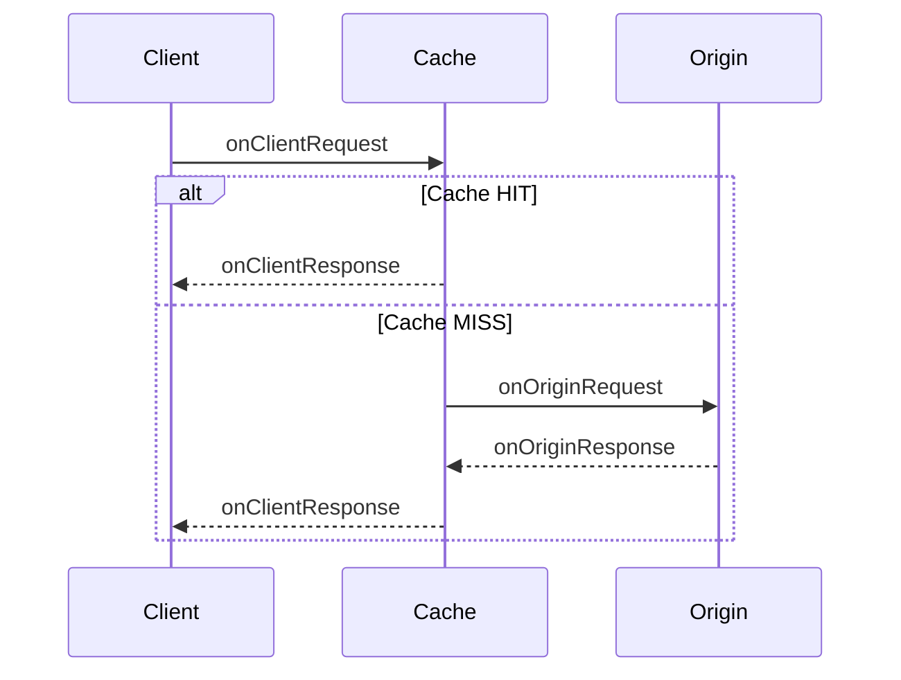

Middleware scripts sit inside the CDN request flow. Your logic runs on requests on their way in and on responses on their way out, so you can change how traffic behaves without touching your backend, and the work happens at the edge rather than on your origin.

A middleware script can run at two points in the request flow:

- **Origin hooks** (`onOriginRequest`, `onOriginResponse`) run between the cache
  and your origin. They run only on a cache MISS. This is the default.
- **Client hooks** (`onClientRequest`, `onClientResponse`) run between the
  client and the cache. They run on every request, including cache hits. To use
  them, enable **Run script before cache** in your Pull Zone, under
  **General** > **Origin**. See [before cache execution](/scripting/before-cache).

One script can use both types of hooks.

## Choose a hook

| Hook               | Runs                                    | Runs on a cache HIT | Needs **Run script before cache** | Example uses (not a complete list) |
| ------------------ | --------------------------------------- | ------------------- | --------------------------------- | ---------------------------------- |
| `onClientRequest`  | Before the cache lookup                 | Yes                 | Yes                               | [Verify credentials](/scripting/middleware/examples/protect-cached-content), rate limiting, IP filtering, bot protection, A/B tests, redirects |
| `onOriginRequest`  | Before the request goes to the origin   | No                  | No                                | Add or remove headers on the request to the origin, such as a secret the origin checks |
| `onOriginResponse` | After the origin responds, before cache | No                  | No                                | [Rewrite HTML or the response body](/scripting/middleware/examples/modify-body), set headers that are cached with the response  |
| `onClientResponse` | Before the response goes to the client  | Yes                 | Yes                               | Add headers to every response, including cached responses                         |

<Warning>
  Origin hooks run only on a cache MISS. The CDN serves a cached response
  without them. An access check in `onOriginRequest` does not protect cached
  content. For access control, enable
  [before cache execution](/scripting/before-cache), and put the check in
  `onClientRequest`.
</Warning>

## The `servePullZone` function

The `servePullZone` function creates a middleware handler that integrates with your Pull Zone. It returns a chainable object for adding request and response middleware.

```ts
import * as BunnySDK from "@bunny.net/edgescript-sdk@0.13.0";

BunnySDK.net.http
  .servePullZone({ url: "https://your-origin.com" })
  .onOriginRequest((ctx) => {
    // Modify or intercept requests
    return Promise.resolve(ctx.request);
  })
  .onOriginResponse((ctx) => {
    // Modify responses
    return Promise.resolve(ctx.response);
  });
```

### Function signature

```ts
servePullZone(options: { url: string }): PullZoneHandler
```

| Option | Type     | Description                                                                                                           |
| ------ | -------- | --------------------------------------------------------------------------------------------------------------------- |
| `url`  | `string` | The origin URL to proxy requests to. Only used during local development; in production, the Pull Zone origin is used. |

<Info>
  The `url` option is only used during local development. When deployed to
  bunny.net, requests are proxied to the origin configured in your Pull Zone
  settings.
</Info>

## Middleware methods

The `servePullZone` function returns a `PullZoneHandler` object with chainable middleware methods:

### `onClientRequest`

<Info>
This hook runs only when your Pull Zone has
[before cache execution](/scripting/before-cache) enabled. If it is off, the
hook does not run, and no error shows.
</Info>

Intercepts requests before they are sent to the cache. You can modify the request
or short-circuit by returning a response directly.

```ts
onClientRequest(
  middleware: (ctx: { request: Request }) => Promise<Response> | Response | Promise<Request> | Request | void
): PullZoneHandler
```

| Property      | Type      | Description                 |
| ------------- | --------- | --------------------------- |
| `ctx.request` | `Request` | The incoming request object |

**Return value:**

- Return `Promise<Request>` to continue to the cache lookup with the
  (modified) request. On a cache MISS, the request then goes to the origin.
- Return `Promise<Response>` to short-circuit and respond immediately without
  hitting the cache. `onClientResponse` does not run for this response.

### `onClientResponse` 

<Info>
This hook runs only when your Pull Zone has
[before cache execution](/scripting/before-cache) enabled.
</Info>

Intercepts responses before they are returned to the user, including responses
served from the cache.

```ts
onClientResponse(
  middleware: (ctx: { request: Request; response: Response }) => Promise<Response> | Response
): PullZoneHandler
```

| Property       | Type       | Description                         |
| -------------- | ---------- | ----------------------------------- |
| `ctx.request`  | `Request`  | The original request object         |
| `ctx.response` | `Response` | The response from the origin server |

**Return value:**

- Return `Promise<Response>` or `Response` with the (modified) response to send
to the client.

### `onOriginRequest`

Intercepts requests before they are sent to the origin server. It runs only on a cache MISS. You can modify the request or short-circuit by returning a response directly.

```ts
onOriginRequest(
  middleware: (ctx: { request: Request }) => Promise<Request> | Promise<Response>
): PullZoneHandler
```

| Property      | Type      | Description                 |
| ------------- | --------- | --------------------------- |
| `ctx.request` | `Request` | The incoming request object |

**Return value:**

- Return `Promise<Request>` to continue to the origin with the (modified) request
- Return `Promise<Response>` to short-circuit and respond immediately without hitting the origin. The CDN handles this response like an origin response, so it can be cached.

### `onOriginResponse`

Intercepts responses from the origin server before they are sent to the client. Modifications occur before the response is cached.

```ts
onOriginResponse(
  middleware: (ctx: { request: Request; response: Response }) => Promise<Response>
): PullZoneHandler
```

| Property       | Type       | Description                         |
| -------------- | ---------- | ----------------------------------- |
| `ctx.request`  | `Request`  | The original request object         |
| `ctx.response` | `Response` | The response from the origin server |

**Return value:**

- Return `Promise<Response>` with the (modified) response to send to the client

## Enable before cache scripts

Before cache execution is turned on per Pull Zone. Navigate to your Pull Zone,
then go to **General** > **Origin** and enable **Run script before cache**.

<Info>
Learn more about [before cache execution](/scripting/before-cache).
</Info>

## Workflow

When a client makes a request to a Pull Zone, the request passes through middleware at different stages:

<Info>
`onClientRequest` and `onClientResponse` run only when your Pull Zone has
before cache execution enabled.
</Info>

1. **`onClientRequest`** - Called before the request is sent to the cache. Modify the request or return a response to short-circuit.
2. **`onOriginRequest`** - Called before the request is sent to the origin, so only when the cache returns a *MISS*. Modify the request or return a response to short-circuit.
3. **Origin fetch** - The request is sent to your origin server.
4. **`onOriginResponse`** - Called after the origin responds. Modify the response before it's sent to the client and cached.
5. **`onClientResponse`** - Called just before a response is sent to the client, unless you short-circuited at the `onClientRequest` layer.


```mermaid
sequenceDiagram
    participant Client
    participant Cache
    participant Origin

    Client->>Cache: onClientRequest
    alt Cache HIT
        Cache-->>Client: onClientResponse
    else Cache MISS
        Cache->>Origin: onOriginRequest
        Origin-->>Cache: onOriginResponse
        Cache-->>Client: onClientResponse
    end
```

## Example

This example gates a route behind a feature flag, and adds a custom header to
responses from the origin. The flag check runs in `onClientRequest`, so it also
applies to cached responses. Enable before cache execution to run it.

```ts
import * as BunnySDK from "@bunny.net/edgescript-sdk@0.13.0";

BunnySDK.net.http
  .servePullZone({ url: "https://echo.free.beeceptor.com/" })
  .onClientRequest((ctx) => {
    const optFT = ctx.request.headers.get("feature-flags");
    const featureFlags = optFT
      ? optFT.split(",").map((v) => v.trimStart())
      : [];

    // Route-based matching and feature flag check
    const path = new URL(ctx.request.url).pathname;
    if (path === "/d") {
      if (!featureFlags.includes("route-d-preview")) {
        // Short-circuit: return response without the cache or the origin
        return Promise.resolve(
          new Response("You cannot use this route.", { status: 400 }),
        );
      }
    }

    // Continue to the cache lookup with the request
    return Promise.resolve(ctx.request);
  })
  .onOriginResponse((ctx) => {
    // Add custom header to the response before it is cached
    ctx.response.headers.append("X-Via", "MyMiddleware");
    return Promise.resolve(ctx.response);
  });
```

### Local development

You can run middleware scripts locally using Deno:

```bash
deno run -A script.ts
```

Test with curl:

```bash
# Blocked - missing required feature flag
curl http://127.0.0.1:8080/d --header 'feature-flags: something-else'

# Allowed - has required feature flag
curl http://127.0.0.1:8080/d --header 'feature-flags: route-d-preview, something-else'
```
